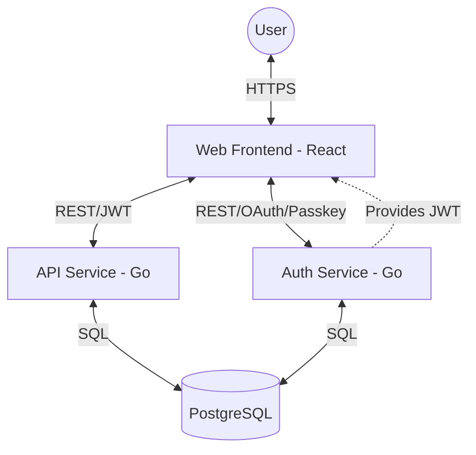

# Architecture

FitFeed follows a microservices architecture with a focus on privacy and security.

## System Overview

## Clean Code Pattern

All Go services follow a layered approach:

- **Entity:** Domain-specific data models and business logic.
- **UseCase:** Application-specific business rules and use cases.
- **Controller:** Entry points (HTTP handlers) that interact with use cases.
- **Repo:** Data access layer (GORM repositories).

## Security & Authentication

FitFeed provides several authentication methods to ensure user privacy:

- **Passkeys (WebAuthn):** Provides a secure, passwordless login experience.
- **OAuth:** Allows users to log in through popular providers like Google or GitHub.
- **JWT (JSON Web Tokens):** Used for session management and route protection across all services.

## Service Communication

Currently, services communicate primarily through HTTP:

- **Auth Service:** Manages registration, login, and JWT generation.
- **API Service:** Main entry point for the frontend, providing profile data and application state.
- **Web Service:** The React-based frontend client.

## Data Layer

The data layer is managed by a centralized `dbm` service. All services share a PostgreSQL database, but are responsible for their respective data schemas. Migrations are managed using Goose and GORM.
