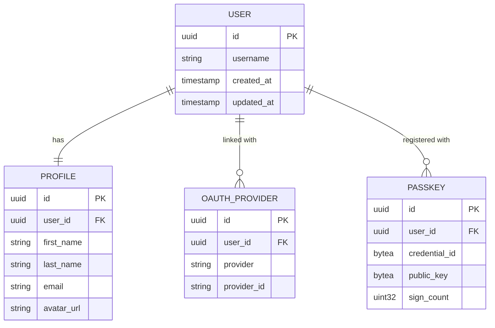

# Data Models

FitFeed uses a PostgreSQL database for data storage. All models are defined using GORM and follow a consistent structure.

## ER Diagram

## Base Model

The base model contains common fields for all tables:

- **ID:** UUID (primary key)
- **CreatedAt:** timestamp
- **UpdatedAt:** timestamp
- **DeletedAt:** timestamp (for soft deletes)

## User

The `User` table is the core of the authentication system:

- **Username:** Unique, required.
- **Profile:** One-to-one relationship with `Profile`.
- **OauthProviders:** One-to-many relationship with `OauthProvider`.
- **Passkeys:** One-to-many relationship with `Passkey`.

## Profile

The `Profile` table contains personal information for each user:

- **FirstName:** User's first name.
- **LastName:** User's last name.
- **AvatarURL:** Link to user's avatar image.
- **Email:** Unique email address.
- **UserID:** Foreign key to `User`.

## OauthProvider

The `OauthProvider` table stores authentication details for third-party providers:

- **Provider:** Name of the provider (e.g., "google").
- **ProviderID:** Unique ID from the provider.
- **UserID:** Foreign key to `User`.

## Passkey

The `Passkey` table stores WebAuthn credentials:

- **CredentialID:** Unique ID from the authenticator.
- **PublicKey:** Public key from the authenticator.
- **AttestationType:** Type of attestation used.
- **SignCount:** Current sign count for the credential.
- **UserID:** Foreign key to `User`.
